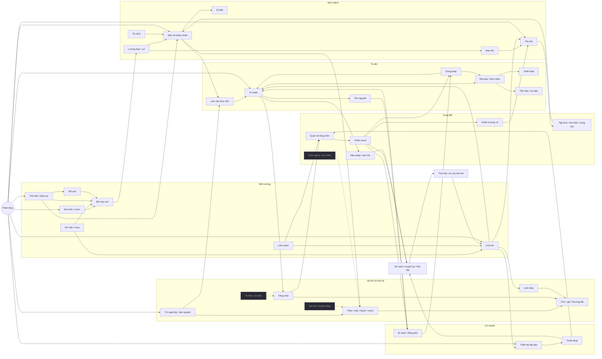

# Hệ quy luật thế giới Thiên Đạo (đối chiếu `Docs/WorldRules.md`)

**Cập nhật:** 2026-10-08, sau devlog 28 (công pháp và truyền thừa đã có).

**Tài liệu này dùng để:**
- Đối chiếu từng yêu cầu trong `WorldRules.md` với mô phỏng hiện có.
- Viết các luật cốt lõi theo khung 8 trường: Input State → Điều kiện → Hành động → Kết quả → Tác dụng phụ → Hệ bị ảnh hưởng → Hệ quả lâu dài → Chuỗi phản ứng.
- Vẽ World Rule Graph.
- Liệt kê phần còn thiếu theo thứ tự ưu tiên.

**Ký hiệu trạng thái:** **Có**: đã cài và móc vào các hệ khác. **Một phần**: có nhưng còn mỏng. **Chưa**: chưa có.

**Tóm tắt:**
- Khung chuỗi nhân quả của thế giới đã chạy: Environment → Life → Resource → Cultivation → Society → Economy → Faction → Conflict → History.
- Còn thiếu năm mảng lớn:
  1. ~~Công pháp và truyền thừa~~ (đã cài ở devlog 28).
  2. **Tri thức và tin đồn** (Knowledge).
  3. **Gia tộc, huyết thống và nội chiến của nước phàm nhân** (Family, Rebellion, Civil war).
  4. **Ngày/đêm.**
  5. **Tài nguyên khoáng (gỗ, đá, kim loại) và phi thăng.**

---

## 0. World Rule Graph

Nét liền là quan hệ nhân quả đã chạy trong mô phỏng. Nét đứt là phần chưa có (đề xuất ở mục 15).

**Một chuỗi đang thực sự chạy trong mô phỏng (không viết sẵn):**
1. Linh khí phục tô.
2. Tu sĩ đột phá nhanh hơn.
3. Tông môn mạnh lên, mở lãnh thổ, tranh linh mạch.
4. Tranh chấp biên giới làm thiện cảm giữa hai tông giảm.
5. Chiến tranh nổ ra.
6. Chiến trường cổ để lại oán khí.
7. Oán khí sinh yêu thú và kéo ma tu tới.
8. Một con thành hung thú, tàn sát các thành.
9. Làng cầu nguyện, các tông lập liên minh trảm yêu.
10. Người tung đòn cuối thành truyền kỳ.
11. Sử sách ghi lại, thời đại đổi tên.

---

## 1. Time Rules

| Yêu cầu | Trạng thái | Ở đâu / ghi chú |
|---|---|---|
| Tick | **Có** | 1 tick = 1 ngày (`SimClock`); hệ nặng chạy theo tháng hoặc năm, chia lượt theo khối |
| Ngày / đêm | **Chưa** | Đề xuất N1 |
| Mùa | **Có** | 4 mùa × 90 ngày. Mùa ảnh hưởng hồi linh khí (×1,25 / 1 / 0,85 / 0,6), cỏ mọc, thú sinh sản ở Xuân/Hạ, nhiệt độ, màu bản đồ |
| Năm | **Có** | 360 ngày; mỗi năm xét làng, thế lực, tu sĩ, thời đại, truyền kỳ |
| Thế hệ | **Một phần** | Phàm nhân theo 17 nhóm 5 tuổi; dòng sư đồ cho tu sĩ. Chưa có gia tộc (N4) |
| Lão hóa | **Có** | Phàm nhân lên nhóm tuổi; thọ nguyên tu sĩ theo cảnh giới cộng phần ban thêm; yêu thú thọ theo giai |
| Sự kiện dài hạn | **Có** | Đại kiếp 8–15 năm, thời đại xét 50 năm một lần, chu kỳ linh khí nghìn năm (mạt pháp ↔ phục tô), vết sẹo lành dần, dung nham nguội dần |
| Tốc độ / dừng / tua | **Có** | 0, 6, 30, 120, 3600 ngày/giây; ngân sách ms mỗi khung hình; giới hạn tồn đọng để không tụt dốc khi máy chậm |

---

## 2. World & Environment Rules

| Yêu cầu | Trạng thái | Ở đâu / ghi chú |
|---|---|---|
| Terrain | **Có** | 20 loại địa hình, đại vực, chiều cao; người chơi vẽ được |
| Water | **Một phần** | Biển, sông (lội được), lũ, chết đuối. Chưa có nước như một tài nguyên |
| Climate / Temperature | **Một phần** | Bản đồ nhiệt độ và độ ẩm quyết định sinh cảnh và cây; có lệch theo mùa. Chưa tác động trực tiếp lên sinh vật (chết rét chỉ có qua thiên tai Rét) |
| Weather | **Có** | Mưa, bão, rét, hạn (tự nhiên và do Thiên Đạo) |
| Fertility | **Có** | Theo đất, sẹo, ruộng, hạn hán và mưa (`HarvestFactor`) |
| Spiritual Energy | **Có** | Trần linh khí theo địa hình và linh mạch; khuếch tán trên lưới thô; tu sĩ hút làm cạn |
| Spiritual Veins | **Có** | Linh mạch nâng trần linh khí; bị động đất làm đứt; núi lửa mở mạch địa hỏa |
| Special Zones | **Có** | Lôi địa, chiến trường cổ (oán khí), núi lửa, cổ mộ và di tích, phúc địa (nơi linh khí đậm) |
| Natural disasters | **Có** | Động đất, núi lửa, lũ, hạn, ôn dịch, thú triều, bão, rét, đại kiếp; gây sát thương theo máu |

### Luật R1: Linh khí
| Trường | Nội dung |
|---|---|
| Input | Trần linh khí `QiCap` (địa hình, linh mạch, nước), linh khí hiện tại, mùa, `QiScale` (quy luật × đại kiếp × thời đại) |
| Điều kiện | Mỗi tháng |
| Hành động | Linh khí trôi về trần × hệ số mùa; khuếch tán sang khối lân cận; tu sĩ hút theo cảnh giới |
| Kết quả | Có phúc địa (nơi linh khí đậm) và vùng cạn kiệt |
| Tác dụng phụ | Nơi đông tu sĩ bị hút cạn; linh vật xuất thế ở nơi đậm nhất |
| Hệ bị ảnh hưởng | Tu luyện, yêu thú thức tỉnh, linh thảo, giá đan, tông môn chọn đất, thiên tài địa bảo |
| Lâu dài | Chu kỳ mạt pháp ↔ phục tô làm cả thế giới mạnh lên hoặc tàn lụi |
| Chuỗi phản ứng | Linh khí ↑ → tu sĩ ↑ → tranh linh mạch ↑ → chiến tranh ↑ → tử trận ↑ → bí cảnh ↑ → cơ duyên ↑ |

### Luật R2: Thiên tai để lại sẹo
| Trường | Nội dung |
|---|---|
| Input | Thiên tai (tự nhiên hoặc do Thiên Đạo), địa hình |
| Điều kiện | Có thiên tai xảy ra |
| Hành động | Ghi vết sẹo lên ô đất: cháy sém, tro, nứt, đá bazan, bùn, giẫm nát |
| Kết quả | Ô đất đổi màu; độ màu mỡ và cỏ giảm |
| Tác dụng phụ | Cây gần đó héo; làng quanh đó mất mùa |
| Hệ bị ảnh hưởng | Mùa màng, thú, di dân, hiển thị bản đồ |
| Lâu dài | Sẹo lành dần qua nhiều năm (tro bụi lại thành đất tốt) |
| Chuỗi phản ứng | Núi lửa → tro phủ → mất mùa → đói → di dân → làng mới ở nơi khác |

---

## 3. Life Rules

| Yêu cầu | Trạng thái | Ở đâu / ghi chú |
|---|---|---|
| Birth → Childhood → Adult → Aging → Death | **Có** | Phàm nhân theo nhóm tuổi; tu sĩ và yêu thú là cá thể; thú hoang là quần thể |
| Hunger | **Có** | Lương thực của làng (ruộng, săn, chợ); chết đói; thú ăn cỏ theo lưới |
| Health | **Có** | Sinh lực (máu) của tu sĩ và yêu thú, hồi theo tháng; đàn thú và dân có máu theo loài |
| Energy / Sleep / Rest | **Một phần** | Bị thương thì về nhà dưỡng thương; hung thú no thì ngủ, ngủ say. Chưa có năng lượng và giấc ngủ theo ngày (N1) |
| Reproduction | **Có** | Sinh theo nhóm tuổi và lương thực; thú sinh ở Xuân/Hạ |
| Disease / Injury | **Có** | Ôn dịch lây theo đường đi; bị thương làm yếu đi |
| Lifespan | **Có** | Theo loài, cảnh giới, giai |
| Migration | **Có** | Di dân khi đói, quá đông, bị thiên tai; dân tị nạn khi kinh thành thất thủ; tu sĩ dời động phủ; thú tràn sang vùng lân cận |

### Luật R3: Lương thực → dân số → di dân
| Trường | Nội dung |
|---|---|
| Input | Ruộng (độ màu mỡ × số người làm), săn, mùa, hạn hán và mưa, lương thực mua ở chợ |
| Điều kiện | Mỗi tháng thu hoạch, mỗi năm sinh tử |
| Hành động | Thiếu ăn thì người chết (người già, trẻ nhỏ trước); dư ăn thì sinh nhiều hơn; đông quá thì tách đoàn di dân |
| Kết quả | Làng lớn lên thành trấn, thành, kinh thành; hoặc tàn lụi, bị bỏ hoang |
| Tác dụng phụ | Mở ruộng chặt cây; giá lương thực ở chợ thay đổi; thương đội chở lương tới nơi đói |
| Hệ bị ảnh hưởng | Thương mại, linh căn (dân đông thì nhiều người thức tỉnh), tông môn (tuyển đệ tử), cầu nguyện |
| Lâu dài | Vùng đất tốt thành trung tâm văn minh; vùng bị sẹo bị bỏ |
| Chuỗi phản ứng | Hạn hán → đói → làng cầu mưa → (Thiên Đạo đáp → tín ngưỡng ↑ → miếu → người có linh căn) hoặc (làm ngơ → di dân → làng mới) |

---

## 4. Resource Rules

| Yêu cầu | Trạng thái | Ở đâu / ghi chú |
|---|---|---|
| Food | **Có** | Ruộng, săn, chợ, thương đội |
| Water | **Chưa** | Đề xuất ở N6: giếng và sông như điều kiện lập làng |
| Wood | **Chưa** | Cây chỉ là vật thể (bị chặt khi mở ruộng, xây tường, bị bão quật đổ) |
| Stone / Metal | **Chưa** | Đề xuất N6: khoáng mạch |
| Spiritual Stone | **Có** | Kho tông môn (thu từ lãnh thổ, linh mạch), tiền của tu sĩ, trong bí cảnh |
| Herbs | **Có** | Linh thảo mọc ở làng có linh khí đậm; tông môn luyện thành đan |
| Rare resources | **Có** | Pháp bảo, yêu đan, thiên tài địa bảo, cổ bảo trong di tích |
| Regeneration / Consumption | **Có** | Linh khí, cỏ, thú hồi lại; người, tu sĩ, thú tiêu thụ |
| Scarcity → giá | **Có** | Giá ở chợ theo mức khan hiếm |
| Depletion | **Một phần** | Linh khí bị hút cạn, cỏ bị gặm trụi, săn làm giảm thú. Chưa có mỏ bị khai cạn |

---

## 5. Cultivation Rules

| Yêu cầu | Trạng thái | Ở đâu / ghi chú |
|---|---|---|
| Spiritual Root | **Có** | Ngũ hành, thiên linh căn, dị linh căn; Thiên Đạo ban hoặc tẩy luyện được |
| Spiritual Energy / Speed | **Có** | Tốc độ theo linh khí tại chỗ, so với mức yêu cầu của cảnh giới |
| Technique (công pháp) | **Có** | Devlog 28: 5 phẩm, trần cảnh giới, hợp linh căn, ma công (`TechniqueSystem`) |
| Realm | **Có** | Luyện Khí (13 tầng) → Trúc Cơ → Kết Đan → Nguyên Anh → Hóa Thần |
| Bottleneck | **Có** | Đỉnh tầng thì phải đột phá; thất bại thì chờ hồi lại nhiều năm; Hóa Thần cần linh khí ≥ 8.000 |
| Breakthrough | **Có** | Tỉ lệ theo ngộ tính, đạo tâm, khí vận, đan (Trúc Cơ Đan của tông môn hoặc đan tự mua) |
| Failure | **Có** | Tu vi mất một phần, đạo tâm giảm; có thể tẩu hỏa |
| Lifespan | **Có** | Lên cảnh giới thì thọ thêm; thọ cạn thì tọa hóa, để lại động phủ |
| Mental State | **Có** | Đạo tâm; Thiên Đạo giáng tâm ma được |
| Qi deviation | **Có** | Chết, tụt cảnh giới, hoặc sa ma đạo (nếu quy luật cho phép) |
| Tribulation | **Có** | Từ Nguyên Anh; Thiên Đạo giáng được; để lại lôi địa; kẻ thù có thể đánh lén người đang độ kiếp |
| Ascension (phi thăng) | **Chưa** | Đề xuất N3 |

Công thức hiện tại là **Talent × Environment × Resources × Technique × Time × Risk**.

### Luật R4: Đột phá
| Trường | Nội dung |
|---|---|
| Input | Cảnh giới, tầng, tu vi tích lũy, ngộ tính, đạo tâm, khí vận, đan, tông môn, quy luật đột phá |
| Điều kiện | Ở đỉnh tầng và đã qua thời gian hồi sau lần thất bại trước |
| Hành động | Tung xác suất; từ Nguyên Anh trở lên phải qua thiên kiếp |
| Kết quả | Lên cảnh giới (thọ, sức, máu tăng), hoặc thất bại: tu vi còn 60%, đạo tâm −0,1, có thể tẩu hỏa |
| Tác dụng phụ | Tông môn tiêu linh thạch mua đan; thiên kiếp đánh cả người xung quanh |
| Hệ bị ảnh hưởng | Thế lực (sức mạnh), chiến tranh, truyền kỳ, Thiên mệnh |
| Lâu dài | Lão tổ Nguyên Anh làm tông môn thành bá chủ một phương |
| Chuỗi phản ứng | Đột phá Nguyên Anh → tông mạnh lên → tông láng giềng lo sợ → liên minh chống lại → chiến tranh |

### Luật R5: Tẩu hỏa nhập ma
| Trường | Nội dung |
|---|---|
| Input | Đạo tâm, số lần thất bại liên tiếp, tâm ma do Thiên Đạo giáng |
| Điều kiện | Đột phá thất bại, hoặc bị giáng tâm ma |
| Hành động | Tung kết quả: chết, tụt cảnh giới, hoặc sa ma đạo |
| Kết quả | Thêm một ma tu |
| Tác dụng phụ | Ma tu giết người đoạt bảo, tìm đến chiến trường cổ luyện ma công |
| Hệ bị ảnh hưởng | Đấu pháp, chiến trường, tông môn hóa ma, tín ngưỡng |
| Lâu dài | Ma đạo lan rộng, tông môn chính tà đối đầu |
| Chuỗi phản ứng | Tâm ma → ma tu → giết người đoạt bảo → sư phụ của nạn nhân báo thù → huyết thù truyền đời |

---

## 6. Entity Decision Rules

| Yêu cầu | Trạng thái | Ở đâu / ghi chú |
|---|---|---|
| Needs / Goals | **Một phần** | Nhân vật chính (được theo dõi) dùng AI theo mục tiêu (`ProtagonistAI`). Tu sĩ khác theo luật: du ngoạn, dời động phủ, báo thù, tranh đoạt, trảm yêu, dưỡng thương |
| Personality | **Có** | Ngộ tính, khí vận, đạo tâm, dã tâm, chính hay tà |
| Knowledge | **Chưa** | Ai cũng "biết" mọi bí cảnh đã lộ. Đề xuất N7 |
| Memory | **Có** | Sư phụ, kẻ thù (nemesis), sử sách cá nhân, danh tiếng |
| Relationships | **Một phần** | Sư đồ, huyết thù. Chưa có bạn bè, đạo lữ |
| Power / Resources / Faction | **Có** | Sức mạnh, máu, linh thạch, đan, pháp bảo, tông môn |
| Perceive → Evaluate → Decide → Act → Observe | **Một phần** | Đủ vòng ở nhân vật chính. Tu sĩ khác chỉ chọn theo luật, không học từ kết quả |

---

## 7. Social Rules

| Yêu cầu | Trạng thái | Ở đâu / ghi chú |
|---|---|---|
| Individual → Village → City | **Có** | Thôn, trấn, thành theo dân số; nhà cửa và công trình theo quy mô |
| Family / Clan | **Chưa** | Đề xuất N4 |
| Nation | **Một phần** | Nước phàm nhân theo đại vực, kinh thành, thất thủ và dời đô. Chưa có chính trị: vua, khởi nghĩa (N5) |
| Sect → Faction | **Có** | Tông môn là thế lực; ngoại môn, nội môn, trưởng lão; tông chủ và kế vị |
| Friendship / Loyalty | **Chưa** | Gắn vào N4 / N8 |
| Reputation | **Một phần** | Danh tiếng (Fame), danh hiệu, truyền kỳ; tín ngưỡng của làng với Thiên Đạo |
| Leadership | **Có** | Tông chủ, tranh kế vị |
| Cooperation | **Có** | Liên minh tông môn, liên minh trảm yêu |
| Betrayal | **Một phần** | Trưởng lão ly khai lập tông mới, sa ma đạo |
| Recruitment / Migration / Hierarchy | **Có** | |

### Luật R6: Tín ngưỡng và cầu nguyện (devlog 27)
| Trường | Nội dung |
|---|---|
| Input | Hạn hán, ôn dịch, kho lương, hung thú đang kéo tới; tín ngưỡng của làng |
| Điều kiện | Làng gặp nạn; xác suất cầu tăng theo tín ngưỡng; mỗi làng hai năm một lần |
| Hành động | Làng cầu nguyện, chờ 4–6 tháng |
| Kết quả | Được đáp (bằng mưa, ban phúc, thiên phạt): tín ngưỡng +25, làng lân cận +5. Bị làm ngơ: −15 |
| Tác dụng phụ | Miếu được dựng hoặc bị bỏ |
| Hệ bị ảnh hưởng | Làng, tu sĩ (người có linh căn, ma tu tà giáo), Thiên mệnh |
| Lâu dài | Vùng thành tâm sinh nhân tài; vùng mất niềm tin sinh ma tu |
| Chuỗi phản ứng | Làm ngơ nhiều lần → tà giáo → ma tu → giết người đoạt bảo → tông chính phái truy sát → chiến tranh chính tà |

---

## 8. Economic Rules

| Yêu cầu | Trạng thái | Ở đâu / ghi chú |
|---|---|---|
| Production | **Có** | Ruộng, săn, linh thảo, luyện đan |
| Consumption / Market / Supply / Demand | **Có** | Mỗi làng một chợ; giá theo kho và nhu cầu |
| Trade | **Có** | Thương đội đi bộ theo đường; đi nhiều thành đường; có thể bị lũ, dung nham, thiên phạt và bão xóa sổ |
| Currency | **Một phần** | Linh thạch cho tu sĩ và tông môn. Phàm nhân chưa có tiền riêng |
| Occupation | **Chưa** | Chưa chia người làm ruộng, thợ, buôn |
| Crafting | **Một phần** | Tông môn luyện đan. Chưa có luyện khí (rèn pháp bảo), chưa có thợ phàm nhân |
| Resource value / Wealth | **Có** | Giá, kho tông môn, tài sản tu sĩ |
| Inequality | **Chưa** | |

Kinh tế không có con số UI giả: giá, kho và chuyến buôn đều là trạng thái mô phỏng thật.

---

## 9. Sect & Faction Rules

| Yêu cầu | Trạng thái |
|---|---|
| Members, Leader, Territory, Resources, Power, Relations, Enemies, Allies | **Có** |
| Reputation | **Một phần** (danh tiếng cá nhân, lịch sử tông) |
| Goals | **Một phần** (ngầm: tranh linh mạch, giữ lãnh thổ) |
| Formation | **Có**: tán tu dã tâm lớn lập tông |
| Growth, Recruitment, Expansion | **Có**: tuyển đệ tử từ làng, mở lãnh thổ theo ô |
| Competition | **Có**: biên giới, linh mạch, cơ duyên |
| Alliance | **Có**: kẻ thù chung kéo hai tông lại gần |
| Internal conflict, Split | **Có**: ly khai, nhất là khi kế vị bị tranh giành |
| Collapse, Replacement | **Có**: bị diệt môn, tông khác chiếm đất |

### Luật R7: Quan hệ tông môn → chiến tranh
| Trường | Nội dung |
|---|---|
| Input | Biên giới chung, số ô tranh chấp, linh mạch, kho linh thạch, lịch sử ly khai, kẻ thù chung, cơ duyên từng tranh, chính hay tà |
| Điều kiện | Mỗi tháng, với các cặp tông ở gần nhau |
| Hành động | Thiện cảm trôi về mức "tự nhiên" của hoàn cảnh hai bên, cộng thêm biến động |
| Kết quả | Trung lập → thù địch → chiến tranh → đình chiến 20 năm |
| Tác dụng phụ | Trận chiến tốn linh thạch; tu sĩ tử trận; chiến trường cổ |
| Hệ bị ảnh hưởng | Lãnh thổ, kinh tế tông, bí cảnh (người chết để lại), yêu thú (oán khí) |
| Lâu dài | Bá chủ một phương, hoặc tông bị diệt nhường đất |
| Chuỗi phản ứng | Thiếu linh thạch → thèm linh mạch nhà bên → chiến tranh → thua → trưởng lão ly khai → tông mới thù tông cũ |

Không có chiến tranh nào được tung ngẫu nhiên: Need → Competition → Tension → Conflict → War → Consequence.

---

## 10. Conflict & War Rules

| Yêu cầu | Trạng thái | Ghi chú |
|---|---|---|
| Personal conflict | **Có** | Đấu pháp khi gặp nhau, báo thù sư phụ hoặc đồ đệ, giết người đoạt bảo |
| Clan conflict | **Chưa** | Cần gia tộc (N4) |
| Sect conflict / Territory war / Resource war | **Có** | Luật R7 |
| Beast invasion | **Có** | Tập kích, thú triều của yêu tộc, hung thú tàn sát (sự kiện thế giới) |
| Rebellion / Civil war | **Chưa** | Đề xuất N5 |
| Major catastrophe | **Có** | Đại kiếp |
| Ảnh hưởng đến Population, Resources, Territory, Power, History | **Có** | |
| Ảnh hưởng đến Economy | **Một phần** | Linh thạch tông môn; chưa có phong tỏa đường buôn |

### Luật R8: Hung thú và liên minh trảm yêu
| Trường | Nội dung |
|---|---|
| Input | Yêu thú giai cao nhất thế giới, cảnh giới cao nhất của tu sĩ, oán khí chiến trường |
| Điều kiện | Xác suất mỗi năm; tối đa 2 con cùng lúc |
| Hành động | Hung thú đi từ thành này sang thành khác tàn sát; tường thành giảm thiệt hại |
| Kết quả | Các tông quanh đó lập liên minh nếu đủ sức, không thì đóng chặt sơn môn |
| Tác dụng phụ | Dân tị nạn; kinh thành thất thủ; làng cầu nguyện; Thiên mệnh "trừ khử hung thú" |
| Hệ bị ảnh hưởng | Dân số, thế lực (tông cùng đánh thì thân thiện hơn), truyền kỳ, tín ngưỡng |
| Lâu dài | Hung thú giữ vết thương; liên minh sau dễ thắng hơn; nó ngủ say rồi thức dậy |
| Chuỗi phản ứng | Chiến tranh → chiến trường cổ → oán khí → hung thú → thành mất → nước phàm nhân dời đô |

---

## 11. Ecology Rules

| Yêu cầu | Trạng thái | Ghi chú |
|---|---|---|
| Plants | **Có** | Cây theo khí hậu; héo gần địa hình độc hại; bị chặt, quật đổ, thiêu |
| Animals / Predators / Food chain | **Có** | Cỏ → hươu, thỏ → sói → yêu thú; người săn thú |
| Beasts / Monsters | **Có** | Yêu thú (14 loài theo địa hình), Yêu Vương và yêu tộc, hung thú |
| Reproduction / Migration | **Có** | |
| Evolution / Spiritual evolution | **Có** | Thú sống lâu trong linh khí đậm thì khai linh trí; lên giai; hóa hình |
| Mutation | **Một phần** | Loài yêu thú theo địa hình, không biến dị theo đời |
| Phản ứng với văn minh | **Một phần** | Ruộng thay cỏ, dân săn bớt thú; yêu thú tập kích làng. Chưa có tuyệt chủng hay di cư lớn vì bị săn quá mức |

### Luật R9: Yêu thú thức tỉnh
| Trường | Nội dung |
|---|---|
| Input | Số thú trong vùng, linh khí của vùng |
| Điều kiện | Linh khí ≥ 2.500 và có nhiều thú; mỗi năm |
| Hành động | Một con khai linh trí, chiếm hang |
| Kết quả | Có yêu thú; nó lên giai theo linh khí và tuổi |
| Tác dụng phụ | Ăn bớt thú của vùng; tập kích làng; tu sĩ đến săn yêu đan |
| Hệ bị ảnh hưởng | Thú, làng, tu sĩ (yêu đan, pháp bảo), tông môn (diệt Yêu Vương) |
| Lâu dài | Yêu tộc dưới một Yêu Vương; thú triều |
| Chuỗi phản ứng | Rót linh khí vào rừng → yêu thú → Yêu Vương → thú triều → làng mất → di dân |

---

## 12. Xianxia Event Rules

Mọi sự kiện cơ duyên đều sinh ra từ trạng thái thế giới:

| Sự kiện | Sinh ra khi | Trạng thái |
|---|---|---|
| Động phủ (Cave Mansion) | Tu sĩ Kết Đan trở lên chết; giữ lại những gì kẻ giết không lấy | **Có** |
| Bí cảnh từ tông bị diệt | Diệt môn | **Có** |
| Cổ mộ / thượng cổ di tích | Có sẵn từ khi tạo thế giới ở nơi hoang vắng; Thiên Đạo mở thêm được | **Có** |
| Chiến trường cổ | Trận lớn, nhiều người chết; oán khí sinh yêu thú, hút ma tu | **Có** |
| Thiên tài địa bảo | Nơi linh khí đậm nhất ngưng tụ; bảo quang xung thiên, cả thiên hạ tới tranh | **Có** |
| Truyền thừa | Pháp bảo và ngọc giản công pháp của người chết, tông bị diệt, thượng cổ; khôi phục sơn môn từ công pháp thất truyền | **Có** (devlog 28) |
| Linh thảo, pháp bảo | Linh khí đậm; giết người hoặc thám hiểm | **Có** |
| Cấm địa | Lôi địa, chiến trường cổ, núi lửa | **Có** |
| Thiên kiếp, đại kiếp | Đột phá / Thiên Đạo; đại kiếp tự đến hoặc do Thiên Đạo | **Có** |

---

## 13. History Rules

| Yêu cầu | Trạng thái |
|---|---|
| Birth, death, breakthrough, great cultivator, sect formation and destruction, discovery, war, disaster, territory change | **Có** (`HistoryLog`, chỉ mục theo người và theo thế lực) |
| World timeline | **Có**: biên niên sử theo thế kỷ, thời đại |
| Character history | **Có**: tiểu sử, danh hiệu, truyền kỳ (`StoryDetector`) |
| Sect history | **Có**: sử tông môn trên thẻ |
| Civilization rise / fall | **Một phần**: thành lớn lên hoặc tàn lụi, kinh thành thất thủ; chưa có triều đại |

---

## 14. Heavenly Dao Rules

| Yêu cầu | Trạng thái | Quyền năng |
|---|---|---|
| Create | **Có** | Địa hình, cây, nhà, tông môn, làng, linh mạch |
| Destroy | **Có** | Xóa vật, diệt môn, thiên tai |
| Bless | **Có** | Ban linh căn, ban cơ duyên, ban pháp bảo, ban phúc cho làng |
| Curse | **Có** | Giáng tâm ma, phế tu vi, ôn dịch |
| Spawn | **Có** | Thú, yêu thú theo giai, hung thú, tu sĩ theo cảnh giới, lập làng |
| Modify terrain / spiritual energy | **Có** | Cọ địa hình, rót và hút linh khí |
| Create resources | **Có** | Thiên tài địa bảo, mở bí cảnh |
| Trigger disaster / tribulation | **Có** | 10 loại thiên tai, thiên kiếp lên một người |
| Revive / Kill | **Có** | Hồi sinh (mang huyết thù), thiên phạt theo sát thương |
| Alter environment | **Có** | Thời tiết, 7 quy luật toàn cầu. Chưa có đổi mùa |

Mọi quyền năng đi qua `IWorldCommand` vào mô phỏng; hậu quả hiện ở map, sử sách và thẻ thông tin. Cầu nguyện và Thiên mệnh (devlog 27) cho người chơi lý do để can thiệp, và cho thế giới ký ức về việc Thiên Đạo đã làm hay đã bỏ qua.

---

## 15. Phần còn thiếu: luật đề xuất (theo thứ tự ưu tiên)

Thứ tự xếp theo số chuỗi phản ứng mới tạo ra trên mỗi đơn vị công sức, và theo hiệu năng.

### N2: Công pháp và truyền thừa (ĐÃ CÀI, devlog 28)
| Trường | Nội dung |
|---|---|
| Input | Tông môn và tu sĩ giữ công pháp (phẩm, ngũ hành, cảnh giới tối đa); linh căn của người học |
| Điều kiện | Tu sĩ vào tông thì học công pháp của tông; nhặt được ngọc giản trong bí cảnh; sư phụ truyền lại |
| Hành động | Tốc độ tu luyện × độ hợp giữa công pháp và linh căn; công pháp có trần cảnh giới; công pháp ma đạo nhanh nhưng dễ tẩu hỏa |
| Kết quả | Thêm trục **Technique** cho tu luyện; tông có công pháp tốt hút nhân tài |
| Tác dụng phụ | Tông bị diệt thì công pháp thất truyền hoặc vào bí cảnh; tranh đoạt truyền thừa |
| Hệ bị ảnh hưởng | Tu luyện, tông môn (sức hút, uy tín), bí cảnh, tranh đoạt, chiến tranh, Thiên Đạo (ban công pháp) |
| Lâu dài | Công pháp thất truyền rồi được tìm lại sau nghìn năm |
| Chuỗi phản ứng | Tông bị diệt → công pháp vào bí cảnh → tán tu nhặt được → lập tông mới mang tên cũ → báo thù |

### N7: Tri thức và tin đồn (ưu tiên 2)
| Trường | Nội dung |
|---|---|
| Input | Sự kiện có vị trí (bí cảnh mở, bảo vật xuất thế, hung thú tới, tông suy yếu) |
| Điều kiện | Tin lan theo đường buôn, di dân, tu sĩ du ngoạn; càng xa càng chậm |
| Hành động | Mỗi tông và tu sĩ chỉ hành động theo những gì đã nghe |
| Kết quả | Người gần biết trước, đến trước; tông xa đến muộn |
| Tác dụng phụ | Có thể có tin sai, tin đồn thổi phồng (tham vọng kéo nhiều người tới một bí cảnh nghèo) |
| Hệ bị ảnh hưởng | Tranh đoạt, chiến tranh (đánh lúc đối phương yếu mà họ chưa biết), thương mại |
| Lâu dài | Vùng đông đường buôn thành trung tâm tin tức |
| Chuỗi phản ứng | Tin bảo vật lan → ba tông kéo tới → đánh nhau → tông thứ tư nghe tin hai tông kiệt sức → đánh úp |
| Hiệu năng | Lưu tin theo vùng thô, lan mỗi tháng; không lưu theo từng người |

### N5 + N4: Nước phàm nhân có chính trị, gia tộc (ưu tiên 3)
| Trường | Nội dung |
|---|---|
| Input | Đói, thuế, thiên tai, kinh thành xa, tông môn bảo hộ hay bóc lột; gia tộc lớn (dòng họ của tu sĩ có tiếng) |
| Điều kiện | Nhiều năm khổ cực liên tiếp, hoặc vua chết không người kế |
| Hành động | Khởi nghĩa; thành tự lập; nước chia đôi (nội chiến) |
| Kết quả | Nước mới, kinh thành mới, biên giới mới |
| Tác dụng phụ | Tông môn chọn phe; di dân; đường buôn đứt |
| Hệ bị ảnh hưởng | Làng, thương mại, tông môn, tín ngưỡng (một nước có thể quốc giáo hóa Thiên Đạo) |
| Lâu dài | Triều đại hưng vong (civilization rise/fall) |
| Chuỗi phản ứng | Hạn hán ba năm → khởi nghĩa → nội chiến → tông môn hai phe tranh → chiến tranh tu chân |

### N1: Ngày / đêm (ưu tiên 4, rẻ)
| Trường | Nội dung |
|---|---|
| Input | Giờ trong ngày (chia nhỏ tick cho hiển thị; logic chỉ cần sáng hoặc tối) |
| Điều kiện | Đêm |
| Hành động | Phàm nhân, thương đội nghỉ; yêu thú và ma tu mạnh hơn (+20%); tập kích làng dễ thành hơn |
| Kết quả | Đi đêm nguy hiểm; tường thành, tháp canh có giá trị hơn |
| Tác dụng phụ | Bản đồ tối dần (pixel, tông màu theo bậc) |
| Hệ bị ảnh hưởng | Di chuyển, chiến đấu, thương mại, yêu thú |
| Lâu dài | Không đáng kể; tăng độ sống động |
| Chuỗi phản ứng | Đêm → yêu thú tập kích → làng xây tháp canh |

### N6: Khoáng mạch, gỗ, đá (ưu tiên 5)
- **Mỏ linh thạch và khoáng** ở núi và đồi, cạn dần khi khai thác.
- **Gỗ và đá để xây:** thành lớn cần gỗ, đá; chặt rừng làm cạn rừng, cây mọc lại chậm.
- **Chuỗi phản ứng:** mỏ cạn → tông nghèo → thèm mỏ nhà bên → chiến tranh; rừng bị chặt → thú mất chỗ → yêu thú tập kích làng.

### N3: Phi thăng (ưu tiên 6, hậu kỳ)
- Hóa Thần viên mãn, linh khí và thiên kiếp đủ thì phi thăng: người đó rời thế giới, để lại truyền thừa và một luồng linh khí lớn.
- **Chuỗi phản ứng:** phi thăng → tông của người đó mất trụ cột → kẻ thù chờ thời → chiến tranh.

### Kỹ thuật đi kèm
- **Hệ Di chuyển là điểm nóng** (50 ms/năm ở năm 1000): lái theo đường chỉ khi đổi ô, gom nhóm người đi cùng đích, hoặc dùng Burst.
- **Mọi luật mới viết theo khung 8 trường ở trên**, và phải chỉ ra được ít nhất một chuỗi phản ứng sang hệ khác trước khi cài.
